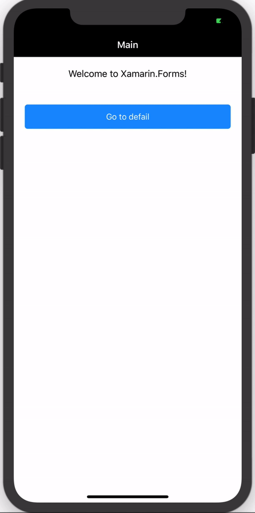
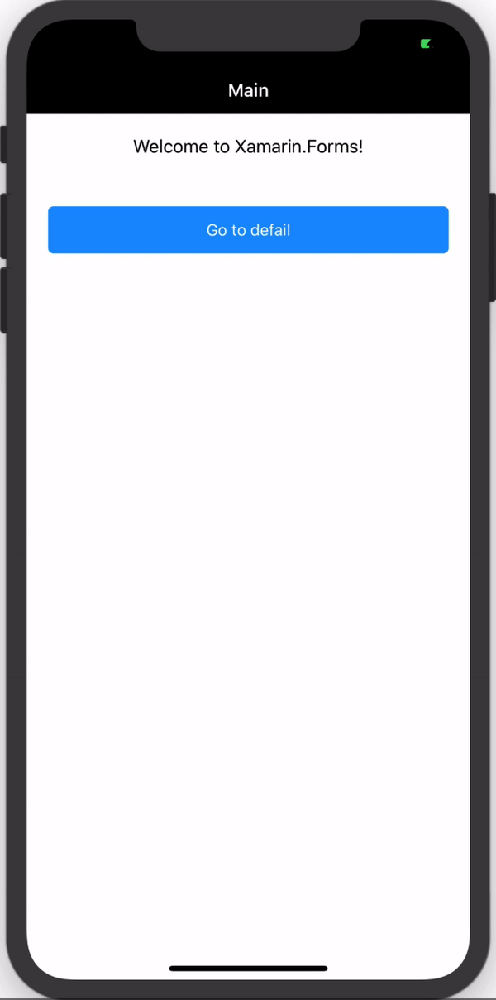
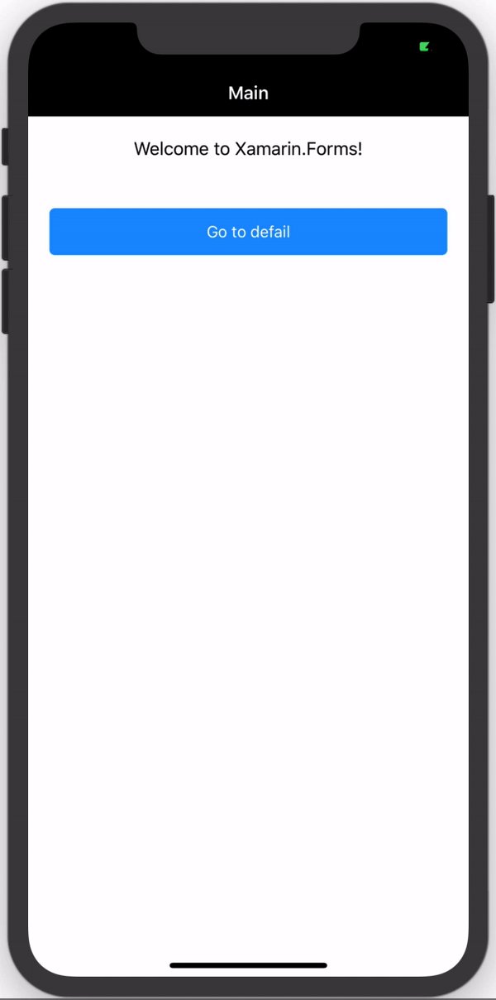
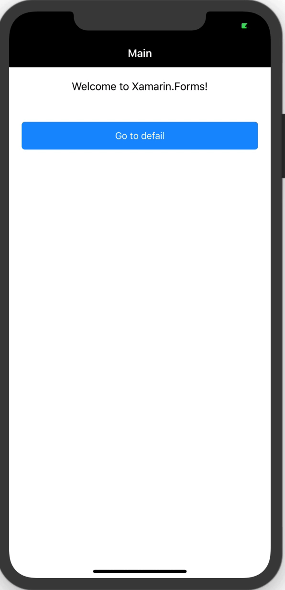

# ConnectionChangesForms
Handling connection changes in Xamarin Forms

&nbsp;&nbsp;&nbsp;&nbsp;&nbsp;&nbsp;&nbsp;

&nbsp;&nbsp;&nbsp;&nbsp;&nbsp;&nbsp;&nbsp;

Blog post: [Handling connection changes in Xamarin Forms](http://xamgirl.com)
